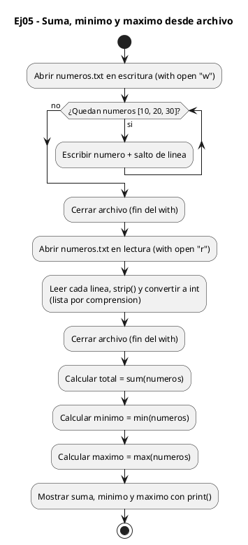
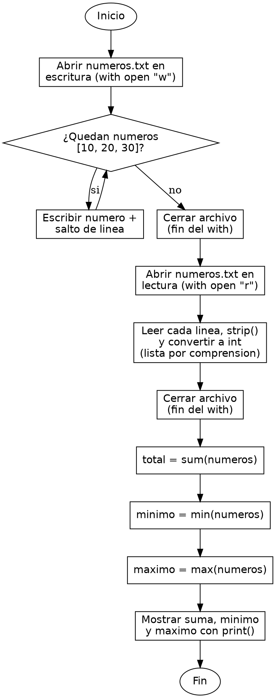

<!-- FICHERO GENERADO — NO EDITAR. Fuente de verdad: curso-python/practica/08-clases-archivos/ej05.md (se regenera con gen_course.py). -->

# Ejercicio 05 — Lee números de numeros.txt (uno por línea) y muestra suma, mínimo y…

Dificultad: amarillo · Módulo 08 (Clases y archivos)

## Enunciado

Lee números de numeros.txt (uno por línea) y muestra suma, mínimo y máximo.

## Diagramas de flujo





## Cómo se resuelve

<!-- EXPLICACION -->
Leer números de un archivo obliga a un paso extra que las listas en memoria no piden: todo lo que sale de un fichero es texto y hay que convertirlo.

1. El bloque `with open("numeros.txt", "w") as f:` crea primero un archivo de prueba con tres números, uno por línea, para que el ejercicio funcione sin depender de un fichero externo. `f.write(f"{n}\n")` escribe cada número seguido de un salto de línea.
2. `with open("numeros.txt", "r") as f:` reabre el mismo archivo en modo lectura. Recuerda que `with` cierra el archivo solo al terminar el bloque, así que no hay que preocuparse de `close()`.
3. `[int(linea.strip()) for linea in f if linea.strip()]` es una comprensión de lista que hace tres cosas en una línea: recorre el archivo línea a línea (`for linea in f`), descarta las líneas vacías (`if linea.strip()`) y convierte cada una en entero. `linea.strip()` elimina el `\n` del final y los espacios; sin ese `strip()`, `int("10\n")` seguiría funcionando pero es frágil, y una línea de solo espacios rompería la conversión.
4. `int(...)` es imprescindible: el archivo guarda `"10"`, texto, no el número 10. Sin convertir, `sum` fallaría o concatenaría cadenas.
5. Con la lista de enteros ya limpia, `sum(numeros)`, `min(numeros)` y `max(numeros)` calculan total, mínimo y máximo directamente.

Trampa habitual: olvidar `.strip()` y arrastrar el `\n` invisible al final de cada línea. Aunque `int()` lo tolere, en comparaciones o al imprimir ese salto oculto provoca errores difíciles de ver.

## Para practicar — cópialo y complétalo

Pega este esqueleto y completa los `TODO`. Es la mejor forma de aprender: inténtalo antes de mirar la solución.

```python
# Curso de Python — Modulo 08: Clases, dataclasses y archivos
# Ejercicio 05 — PRACTICA (rellena los TODO)
# Enunciado: Lee números de numeros.txt (uno por línea) y muestra suma, mínimo y máximo.
# Dificultad: amarillo
# Ejecutar: python3 ej05_practica.py

# Este bloque crea el archivo de prueba; no lo modifiques.
with open("numeros.txt", "w") as f:
    for n in [10, 20, 30]:
        f.write(f"{n}\n")

# TODO: abre "numeros.txt" en modo lectura con open() y with
# TODO: lee todas las lineas y convierte cada una a int (recuerda .strip() para quitar \n)
#       guarda los enteros en una lista llamada numeros

# TODO: calcula la suma con sum()
# TODO: calcula el minimo con min()
# TODO: calcula el maximo con max()

# TODO: imprime los resultados con el formato:
# Salida esperada: Suma: 60  |  Min: 10  |  Max: 30
```

## Solución — cópiala y ejecútala

```python
# Curso de Python — Modulo 08: Clases, dataclasses y archivos
# Ejercicio 05 — MODELO (resuelto)
# Enunciado: Lee números de numeros.txt (uno por línea) y muestra suma, mínimo y máximo.
# Dificultad: amarillo
# Ejecutar: python3 ej05_modelo.py

# Primero creamos el archivo de prueba para que el ejercicio sea autocontenido
with open("numeros.txt", "w") as f:
    for n in [10, 20, 30]:
        f.write(f"{n}\n")

# Ahora leemos y procesamos
with open("numeros.txt", "r") as f:
    # strip() elimina el \n de cada linea antes de convertir a int
    numeros = [int(linea.strip()) for linea in f if linea.strip()]

total = sum(numeros)
minimo = min(numeros)
maximo = max(numeros)

print(f"Suma: {total}  |  Min: {minimo}  |  Max: {maximo}")
```

## Ejecútalo en el navegador

<div class="pyodide-run" data-code="IyBDdXJzbyBkZSBQeXRob24g4oCUIE1vZHVsbyAwODogQ2xhc2VzLCBkYXRhY2xhc3NlcyB5IGFyY2hpdm9zCiMgRWplcmNpY2lvIDA1IOKAlCBNT0RFTE8gKHJlc3VlbHRvKQojIEVudW5jaWFkbzogTGVlIG7Dum1lcm9zIGRlIG51bWVyb3MudHh0ICh1bm8gcG9yIGzDrW5lYSkgeSBtdWVzdHJhIHN1bWEsIG3DrW5pbW8geSBtw6F4aW1vLgojIERpZmljdWx0YWQ6IGFtYXJpbGxvCiMgRWplY3V0YXI6IHB5dGhvbjMgZWowNV9tb2RlbG8ucHkKCiMgUHJpbWVybyBjcmVhbW9zIGVsIGFyY2hpdm8gZGUgcHJ1ZWJhIHBhcmEgcXVlIGVsIGVqZXJjaWNpbyBzZWEgYXV0b2NvbnRlbmlkbwp3aXRoIG9wZW4oIm51bWVyb3MudHh0IiwgInciKSBhcyBmOgogICAgZm9yIG4gaW4gWzEwLCAyMCwgMzBdOgogICAgICAgIGYud3JpdGUoZiJ7bn1cbiIpCgojIEFob3JhIGxlZW1vcyB5IHByb2Nlc2Ftb3MKd2l0aCBvcGVuKCJudW1lcm9zLnR4dCIsICJyIikgYXMgZjoKICAgICMgc3RyaXAoKSBlbGltaW5hIGVsIFxuIGRlIGNhZGEgbGluZWEgYW50ZXMgZGUgY29udmVydGlyIGEgaW50CiAgICBudW1lcm9zID0gW2ludChsaW5lYS5zdHJpcCgpKSBmb3IgbGluZWEgaW4gZiBpZiBsaW5lYS5zdHJpcCgpXQoKdG90YWwgPSBzdW0obnVtZXJvcykKbWluaW1vID0gbWluKG51bWVyb3MpCm1heGltbyA9IG1heChudW1lcm9zKQoKcHJpbnQoZiJTdW1hOiB7dG90YWx9ICB8ICBNaW46IHttaW5pbW99ICB8ICBNYXg6IHttYXhpbW99IikK">
<button class="pyodide-btn" type="button">▶ Ejecutar aquí (Python en el navegador)</button>
<textarea class="pyodide-stdin" rows="2" placeholder="Si el programa pide datos por teclado, escríbelos aquí, uno por línea"></textarea>
<pre class="pyodide-out" hidden></pre>
</div>

[▶ Visualízalo paso a paso en Python Tutor](https://pythontutor.com/visualize.html#code=%23+Curso+de+Python+%E2%80%94+Modulo+08%3A+Clases%2C+dataclasses+y+archivos%0A%23+Ejercicio+05+%E2%80%94+MODELO+%28resuelto%29%0A%23+Enunciado%3A+Lee+n%C3%BAmeros+de+numeros.txt+%28uno+por+l%C3%ADnea%29+y+muestra+suma%2C+m%C3%ADnimo+y+m%C3%A1ximo.%0A%23+Dificultad%3A+amarillo%0A%23+Ejecutar%3A+python3+ej05_modelo.py%0A%0A%23+Primero+creamos+el+archivo+de+prueba+para+que+el+ejercicio+sea+autocontenido%0Awith+open%28%22numeros.txt%22%2C+%22w%22%29+as+f%3A%0A++++for+n+in+%5B10%2C+20%2C+30%5D%3A%0A++++++++f.write%28f%22%7Bn%7D%5Cn%22%29%0A%0A%23+Ahora+leemos+y+procesamos%0Awith+open%28%22numeros.txt%22%2C+%22r%22%29+as+f%3A%0A++++%23+strip%28%29+elimina+el+%5Cn+de+cada+linea+antes+de+convertir+a+int%0A++++numeros+%3D+%5Bint%28linea.strip%28%29%29+for+linea+in+f+if+linea.strip%28%29%5D%0A%0Atotal+%3D+sum%28numeros%29%0Aminimo+%3D+min%28numeros%29%0Amaximo+%3D+max%28numeros%29%0A%0Aprint%28f%22Suma%3A+%7Btotal%7D++%7C++Min%3A+%7Bminimo%7D++%7C++Max%3A+%7Bmaximo%7D%22%29%0A&cumulative=false&curInstr=0&py=3&rawInputLstJSON=%5B%5D) — ve cómo cambian las variables línea a línea.

## Cómo usarlo

Pega el código en un fichero y ejecútalo con tu toolchain habitual (o el botón de Ejecutar de tu editor). Antes de mirar la solución, intenta completar tú el esqueleto: es la mejor forma de aprender.

## Conexiones

- [[Curso_Python/modelo/08-clases-archivos|Teoría del módulo]]
- [[Curso_Python/practica/00_README|Índice del curso]]
