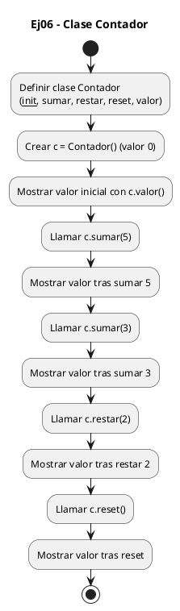
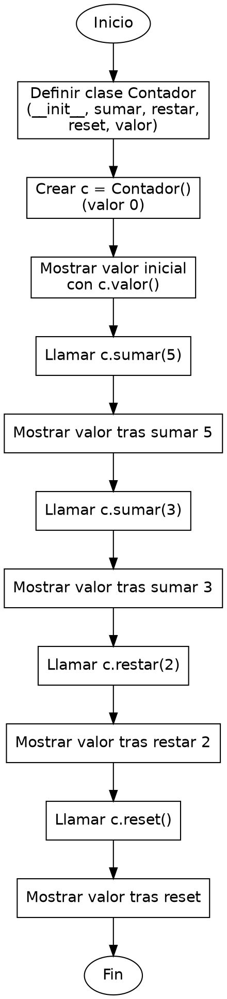

<!-- FICHERO GENERADO — NO EDITAR. Fuente de verdad: curso-python/practica/08-clases-archivos/ej06.md (se regenera con gen_course.py). -->

# Ejercicio 06 — Implementa la clase Contador con metodos sumar(n), restar(n), reset()…

Dificultad: rojo · Módulo 08 (Clases y archivos)

## Enunciado

Implementa la clase Contador con metodos sumar(n), restar(n), reset() y valor().

## Diagramas de flujo





## Cómo se resuelve

<!-- EXPLICACION -->
Un contador es el ejemplo clásico de objeto con estado: guarda un valor que va cambiando, y los métodos son las únicas puertas para tocarlo.

1. `class Contador:` define el molde. `def __init__(self, valor_inicial=0):` es el constructor con un valor por defecto: el `=0` permite crear `Contador()` sin argumentos, o `Contador(10)` para arrancar en 10.
2. `self._valor = valor_inicial` guarda el estado dentro del objeto. El guion bajo inicial (`_valor`) es una convención que avisa "esto es interno, no lo toques desde fuera": la idea es que se modifique solo a través de los métodos, no accediendo a `c._valor` directamente.
3. `sumar`, `restar` y `reset` son métodos que modifican ese estado: `self._valor += n`, `self._valor -= n` y `self._valor = 0`. No devuelven nada; su trabajo es cambiar el atributo del objeto. Cada uno recibe `self` para saber sobre qué contador actúa.
4. `valor(self)` es distinto: no cambia nada, `return self._valor` devuelve el estado actual para poder consultarlo. Por eso en el programa principal escribes `c.valor()` con paréntesis: es una llamada a método, no un atributo suelto.
5. En `c.sumar(5)`, el objeto `c` entra como `self` automáticamente y `5` es la `n`. Cada operación deja el estado actualizado para la siguiente, y `reset()` lo devuelve a 0.

Trampa habitual: confundir `c.valor` con `c.valor()`. Sin paréntesis obtienes el método en sí (el objeto función), no el número; hay que llamarlo con `()` para que se ejecute y devuelva el valor.

## Para practicar — cópialo y complétalo

Pega este esqueleto y completa los `TODO`. Es la mejor forma de aprender: inténtalo antes de mirar la solución.

```python
# Curso de Python — Modulo 08: Clases, dataclasses y archivos
# Ejercicio 06 — PRACTICA (rellena los TODO)
# Enunciado: Implementa la clase Contador con metodos sumar(n), restar(n), reset() y valor().
# Dificultad: rojo
# Ejecutar: python3 ej06_practica.py


class Contador:
    """Contador numerico con operaciones basicas."""

    def __init__(self, valor_inicial=0):
        # TODO: guarda valor_inicial en un atributo interno (convencion: _valor)
        pass

    def sumar(self, n):
        # TODO: incrementa self._valor en n
        pass

    def restar(self, n):
        # TODO: decrementa self._valor en n
        pass

    def reset(self):
        # TODO: reinicia self._valor a 0
        pass

    def valor(self):
        # TODO: devuelve el valor actual de self._valor
        pass


# --- Programa principal ---
c = Contador()
# TODO: imprime el valor inicial
# Salida esperada: Valor inicial: 0

# TODO: llama a c.sumar(5) e imprime el resultado
# Salida esperada: Tras sumar 5: 5

# TODO: llama a c.sumar(3) e imprime el resultado
# Salida esperada: Tras sumar 3: 8

# TODO: llama a c.restar(2) e imprime el resultado
# Salida esperada: Tras restar 2: 6

# TODO: llama a c.reset() e imprime el resultado
# Salida esperada: Tras reset: 0
```

## Solución — cópiala y ejecútala

```python
# Curso de Python — Modulo 08: Clases, dataclasses y archivos
# Ejercicio 06 — MODELO (resuelto)
# Enunciado: Implementa la clase Contador con metodos sumar(n), restar(n), reset() y valor().
# Dificultad: rojo
# Ejecutar: python3 ej06_modelo.py


class Contador:
    """Contador numerico con operaciones basicas."""

    def __init__(self, valor_inicial=0):
        # El estado interno se guarda en un atributo privado por convencion (_valor)
        self._valor = valor_inicial

    def sumar(self, n):
        """Incrementa el contador en n."""
        self._valor += n

    def restar(self, n):
        """Decrementa el contador en n."""
        self._valor -= n

    def reset(self):
        """Reinicia el contador a 0."""
        self._valor = 0

    def valor(self):
        """Devuelve el valor actual del contador."""
        return self._valor


# --- Programa principal ---
c = Contador()
print(f"Valor inicial: {c.valor()}")

c.sumar(5)
print(f"Tras sumar 5: {c.valor()}")

c.sumar(3)
print(f"Tras sumar 3: {c.valor()}")

c.restar(2)
print(f"Tras restar 2: {c.valor()}")

c.reset()
print(f"Tras reset: {c.valor()}")
```

## Ejecútalo en el navegador

<div class="pyodide-run" data-code="IyBDdXJzbyBkZSBQeXRob24g4oCUIE1vZHVsbyAwODogQ2xhc2VzLCBkYXRhY2xhc3NlcyB5IGFyY2hpdm9zCiMgRWplcmNpY2lvIDA2IOKAlCBNT0RFTE8gKHJlc3VlbHRvKQojIEVudW5jaWFkbzogSW1wbGVtZW50YSBsYSBjbGFzZSBDb250YWRvciBjb24gbWV0b2RvcyBzdW1hcihuKSwgcmVzdGFyKG4pLCByZXNldCgpIHkgdmFsb3IoKS4KIyBEaWZpY3VsdGFkOiByb2pvCiMgRWplY3V0YXI6IHB5dGhvbjMgZWowNl9tb2RlbG8ucHkKCgpjbGFzcyBDb250YWRvcjoKICAgICIiIkNvbnRhZG9yIG51bWVyaWNvIGNvbiBvcGVyYWNpb25lcyBiYXNpY2FzLiIiIgoKICAgIGRlZiBfX2luaXRfXyhzZWxmLCB2YWxvcl9pbmljaWFsPTApOgogICAgICAgICMgRWwgZXN0YWRvIGludGVybm8gc2UgZ3VhcmRhIGVuIHVuIGF0cmlidXRvIHByaXZhZG8gcG9yIGNvbnZlbmNpb24gKF92YWxvcikKICAgICAgICBzZWxmLl92YWxvciA9IHZhbG9yX2luaWNpYWwKCiAgICBkZWYgc3VtYXIoc2VsZiwgbik6CiAgICAgICAgIiIiSW5jcmVtZW50YSBlbCBjb250YWRvciBlbiBuLiIiIgogICAgICAgIHNlbGYuX3ZhbG9yICs9IG4KCiAgICBkZWYgcmVzdGFyKHNlbGYsIG4pOgogICAgICAgICIiIkRlY3JlbWVudGEgZWwgY29udGFkb3IgZW4gbi4iIiIKICAgICAgICBzZWxmLl92YWxvciAtPSBuCgogICAgZGVmIHJlc2V0KHNlbGYpOgogICAgICAgICIiIlJlaW5pY2lhIGVsIGNvbnRhZG9yIGEgMC4iIiIKICAgICAgICBzZWxmLl92YWxvciA9IDAKCiAgICBkZWYgdmFsb3Ioc2VsZik6CiAgICAgICAgIiIiRGV2dWVsdmUgZWwgdmFsb3IgYWN0dWFsIGRlbCBjb250YWRvci4iIiIKICAgICAgICByZXR1cm4gc2VsZi5fdmFsb3IKCgojIC0tLSBQcm9ncmFtYSBwcmluY2lwYWwgLS0tCmMgPSBDb250YWRvcigpCnByaW50KGYiVmFsb3IgaW5pY2lhbDoge2MudmFsb3IoKX0iKQoKYy5zdW1hcig1KQpwcmludChmIlRyYXMgc3VtYXIgNToge2MudmFsb3IoKX0iKQoKYy5zdW1hcigzKQpwcmludChmIlRyYXMgc3VtYXIgMzoge2MudmFsb3IoKX0iKQoKYy5yZXN0YXIoMikKcHJpbnQoZiJUcmFzIHJlc3RhciAyOiB7Yy52YWxvcigpfSIpCgpjLnJlc2V0KCkKcHJpbnQoZiJUcmFzIHJlc2V0OiB7Yy52YWxvcigpfSIpCg==">
<button class="pyodide-btn" type="button">▶ Ejecutar aquí (Python en el navegador)</button>
<textarea class="pyodide-stdin" rows="2" placeholder="Si el programa pide datos por teclado, escríbelos aquí, uno por línea"></textarea>
<pre class="pyodide-out" hidden></pre>
</div>

[▶ Visualízalo paso a paso en Python Tutor](https://pythontutor.com/visualize.html#code=%23+Curso+de+Python+%E2%80%94+Modulo+08%3A+Clases%2C+dataclasses+y+archivos%0A%23+Ejercicio+06+%E2%80%94+MODELO+%28resuelto%29%0A%23+Enunciado%3A+Implementa+la+clase+Contador+con+metodos+sumar%28n%29%2C+restar%28n%29%2C+reset%28%29+y+valor%28%29.%0A%23+Dificultad%3A+rojo%0A%23+Ejecutar%3A+python3+ej06_modelo.py%0A%0A%0Aclass+Contador%3A%0A++++%22%22%22Contador+numerico+con+operaciones+basicas.%22%22%22%0A%0A++++def+__init__%28self%2C+valor_inicial%3D0%29%3A%0A++++++++%23+El+estado+interno+se+guarda+en+un+atributo+privado+por+convencion+%28_valor%29%0A++++++++self._valor+%3D+valor_inicial%0A%0A++++def+sumar%28self%2C+n%29%3A%0A++++++++%22%22%22Incrementa+el+contador+en+n.%22%22%22%0A++++++++self._valor+%2B%3D+n%0A%0A++++def+restar%28self%2C+n%29%3A%0A++++++++%22%22%22Decrementa+el+contador+en+n.%22%22%22%0A++++++++self._valor+-%3D+n%0A%0A++++def+reset%28self%29%3A%0A++++++++%22%22%22Reinicia+el+contador+a+0.%22%22%22%0A++++++++self._valor+%3D+0%0A%0A++++def+valor%28self%29%3A%0A++++++++%22%22%22Devuelve+el+valor+actual+del+contador.%22%22%22%0A++++++++return+self._valor%0A%0A%0A%23+---+Programa+principal+---%0Ac+%3D+Contador%28%29%0Aprint%28f%22Valor+inicial%3A+%7Bc.valor%28%29%7D%22%29%0A%0Ac.sumar%285%29%0Aprint%28f%22Tras+sumar+5%3A+%7Bc.valor%28%29%7D%22%29%0A%0Ac.sumar%283%29%0Aprint%28f%22Tras+sumar+3%3A+%7Bc.valor%28%29%7D%22%29%0A%0Ac.restar%282%29%0Aprint%28f%22Tras+restar+2%3A+%7Bc.valor%28%29%7D%22%29%0A%0Ac.reset%28%29%0Aprint%28f%22Tras+reset%3A+%7Bc.valor%28%29%7D%22%29%0A&cumulative=false&curInstr=0&py=3&rawInputLstJSON=%5B%5D) — ve cómo cambian las variables línea a línea.

## Cómo usarlo

Pega el código en un fichero y ejecútalo con tu toolchain habitual (o el botón de Ejecutar de tu editor). Antes de mirar la solución, intenta completar tú el esqueleto: es la mejor forma de aprender.

## Conexiones

- [[Curso_Python/modelo/08-clases-archivos|Teoría del módulo]]
- [[Curso_Python/practica/00_README|Índice del curso]]
