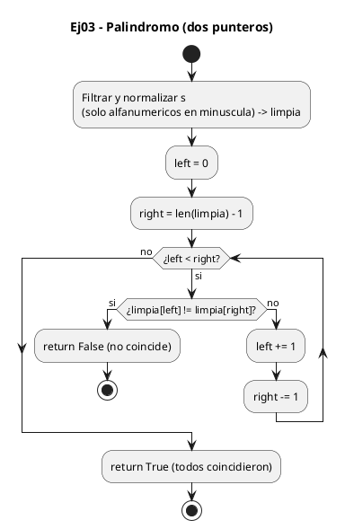
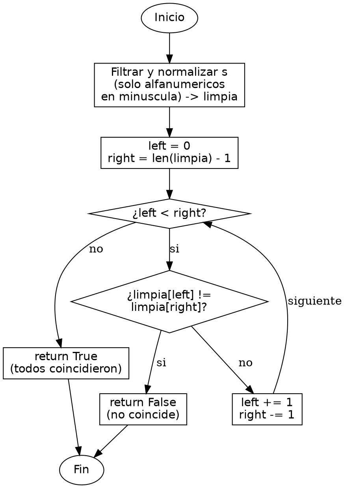

<!-- FICHERO GENERADO — NO EDITAR. Fuente de verdad: curso-python/practica/09-puente-neetcode/ej03.md (se regenera con gen_course.py). -->

# Ejercicio 03 — Ignorando no-alfanuméricos y mayúsculas, determina si s es palíndromo

Dificultad: verde · Módulo 09 (Puente a NeetCode)

## Enunciado

ignorando no-alfanuméricos y mayúsculas, determina si s es palíndromo

## Diagramas de flujo





## Cómo se resuelve

<!-- EXPLICACION -->
Comprobar si algo es palíndromo es el ejercicio canónico de dos punteros: dos índices que arrancan en los extremos y se cierran hacia el centro comparando por parejas.

1. `limpia = [c.lower() for c in s if c.isalnum()]` — primero normalizamos. El enunciado pide ignorar signos, espacios y mayúsculas, así que nos quedamos solo con caracteres alfanuméricos (`isalnum()`) pasados a minúscula. Sin esto compararíamos comas y espacios.
2. `left = 0` y `right = len(limpia) - 1` colocan un puntero en cada extremo de la cadena limpia.
3. `while left < right:` avanza mientras no se crucen. Si en algún par `limpia[left] != limpia[right]`, no es palíndromo y devolvemos `False` de inmediato. Si coinciden, `left += 1` y `right -= 1` acercan ambos al centro.
4. Solo hace falta recorrer media cadena (los punteros se encuentran en el medio): O(n) tiempo. El espacio es O(n) por la lista `limpia`.

Trampa habitual: creer que `s == s[::-1]` es equivalente. Sobre la cadena original fallaría por los signos y las mayúsculas; funcionaría solo sobre `limpia`, pero entonces construyes una segunda lista invertida. Los dos punteros comparan in situ sin copiar nada extra.

## Para practicar — cópialo y complétalo

Pega este esqueleto y completa los `TODO`. Es la mejor forma de aprender: inténtalo antes de mirar la solución.

```python
# Curso de Python — Modulo 09: Puente a NeetCode
# Ejercicio 03 — PRACTICA (rellena los TODO)
# Enunciado: ignorando no-alfanuméricos y mayúsculas, determina si s es palíndromo
# Dificultad: verde
# Ejecutar: python3 ej03_practica.py

# PISTA: usa c.isalnum() para filtrar y c.lower() para normalizar.
# Despues aplica dos punteros: left=0, right=len-1, avanza ambos hacia el centro.


def is_palindrome(s: str) -> bool:
    """Devuelve True si s es palindromo ignorando no-alfanumericos y mayusculas."""
    # TODO 1: construye una lista 'limpia' con los caracteres de s
    #         que sean alfanumericos (c.isalnum()) convertidos a minuscula (c.lower())
    #         Usa una list comprehension: [... for c in s if ...]
    limpia = ...

    # TODO 2: inicializa left = 0 y right = ultimo indice de limpia
    left = ...
    right = ...

    # TODO 3: bucle while left < right
    while ...:
        # TODO 4: si limpia[left] != limpia[right], devuelve False
        if ...:
            return ...

        # TODO 5: mueve ambos punteros hacia el centro
        left += ...
        right -= ...

    # TODO 6: si el bucle termina sin encontrar diferencias, devuelve True
    return ...


# --- Pruebas (no toques esta parte) ---
if __name__ == "__main__":
    casos = [
        ("A man, a plan, a canal: Panama", True),
        ("race a car",                     False),
        (" ",                              True),
        ("Was it a car or a cat I saw?",   True),
    ]

    for s, esperado in casos:
        resultado = is_palindrome(s)
        estado = "OK" if resultado == esperado else "FALLO"
        print(f"[{estado}] is_palindrome({s!r}) = {resultado}  (esperado {esperado})")
```

## Solución — cópiala y ejecútala

```python
# Curso de Python — Modulo 09: Puente a NeetCode
# Ejercicio 03 — MODELO (resuelto)
# Enunciado: ignorando no-alfanuméricos y mayúsculas, determina si s es palíndromo
# Dificultad: verde
# Ejecutar: python3 ej03_modelo.py

# PATRON: dos punteros (left y right) que avanzan hacia el centro.
# Primero limpiamos la cadena: nos quedamos solo con caracteres
# alfanumericos en minusculas. Luego comparamos desde los extremos.
# Coste: O(n) tiempo, O(n) espacio (por la lista limpia).


def is_palindrome(s: str) -> bool:
    """Devuelve True si s es palindromo ignorando no-alfanumericos y mayusculas."""
    # Paso 1: filtrar y normalizar
    limpia = [c.lower() for c in s if c.isalnum()]

    # Paso 2: dos punteros
    left = 0
    right = len(limpia) - 1

    while left < right:
        if limpia[left] != limpia[right]:
            return False   # par no coincide -> no es palindromo
        left += 1
        right -= 1

    return True   # todos los pares coincidieron


# --- Pruebas manuales ---
if __name__ == "__main__":
    casos = [
        ("A man, a plan, a canal: Panama", True),
        ("race a car",                     False),
        (" ",                              True),   # cadena vacia/espacio -> True
        ("Was it a car or a cat I saw?",   True),
    ]

    for s, esperado in casos:
        resultado = is_palindrome(s)
        estado = "OK" if resultado == esperado else "FALLO"
        print(f"[{estado}] is_palindrome({s!r}) = {resultado}  (esperado {esperado})")
```

## Ejecútalo en el navegador

[▶ Visualízalo paso a paso en Python Tutor](https://pythontutor.com/visualize.html#code=%23+Curso+de+Python+%E2%80%94+Modulo+09%3A+Puente+a+NeetCode%0A%23+Ejercicio+03+%E2%80%94+MODELO+%28resuelto%29%0A%23+Enunciado%3A+ignorando+no-alfanum%C3%A9ricos+y+may%C3%BAsculas%2C+determina+si+s+es+pal%C3%ADndromo%0A%23+Dificultad%3A+verde%0A%23+Ejecutar%3A+python3+ej03_modelo.py%0A%0A%23+PATRON%3A+dos+punteros+%28left+y+right%29+que+avanzan+hacia+el+centro.%0A%23+Primero+limpiamos+la+cadena%3A+nos+quedamos+solo+con+caracteres%0A%23+alfanumericos+en+minusculas.+Luego+comparamos+desde+los+extremos.%0A%23+Coste%3A+O%28n%29+tiempo%2C+O%28n%29+espacio+%28por+la+lista+limpia%29.%0A%0A%0Adef+is_palindrome%28s%3A+str%29+-%3E+bool%3A%0A++++%22%22%22Devuelve+True+si+s+es+palindromo+ignorando+no-alfanumericos+y+mayusculas.%22%22%22%0A++++%23+Paso+1%3A+filtrar+y+normalizar%0A++++limpia+%3D+%5Bc.lower%28%29+for+c+in+s+if+c.isalnum%28%29%5D%0A%0A++++%23+Paso+2%3A+dos+punteros%0A++++left+%3D+0%0A++++right+%3D+len%28limpia%29+-+1%0A%0A++++while+left+%3C+right%3A%0A++++++++if+limpia%5Bleft%5D+%21%3D+limpia%5Bright%5D%3A%0A++++++++++++return+False+++%23+par+no+coincide+-%3E+no+es+palindromo%0A++++++++left+%2B%3D+1%0A++++++++right+-%3D+1%0A%0A++++return+True+++%23+todos+los+pares+coincidieron%0A%0A%0A%23+---+Pruebas+manuales+---%0Aif+__name__+%3D%3D+%22__main__%22%3A%0A++++casos+%3D+%5B%0A++++++++%28%22A+man%2C+a+plan%2C+a+canal%3A+Panama%22%2C+True%29%2C%0A++++++++%28%22race+a+car%22%2C+++++++++++++++++++++False%29%2C%0A++++++++%28%22+%22%2C++++++++++++++++++++++++++++++True%29%2C+++%23+cadena+vacia%2Fespacio+-%3E+True%0A++++++++%28%22Was+it+a+car+or+a+cat+I+saw%3F%22%2C+++True%29%2C%0A++++%5D%0A%0A++++for+s%2C+esperado+in+casos%3A%0A++++++++resultado+%3D+is_palindrome%28s%29%0A++++++++estado+%3D+%22OK%22+if+resultado+%3D%3D+esperado+else+%22FALLO%22%0A++++++++print%28f%22%5B%7Bestado%7D%5D+is_palindrome%28%7Bs%21r%7D%29+%3D+%7Bresultado%7D++%28esperado+%7Besperado%7D%29%22%29%0A&cumulative=false&curInstr=0&py=3&rawInputLstJSON=%5B%5D) — ve cómo cambian las variables línea a línea.

## Cómo usarlo

Pega el código en un fichero y ejecútalo con tu toolchain habitual (o el botón de Ejecutar de tu editor). Antes de mirar la solución, intenta completar tú el esqueleto: es la mejor forma de aprender.

## Conexiones

- [[Curso_Python/modelo/09-puente-neetcode|Teoría del módulo]]
- [[Curso_Python/practica/00_README|Índice del curso]]
